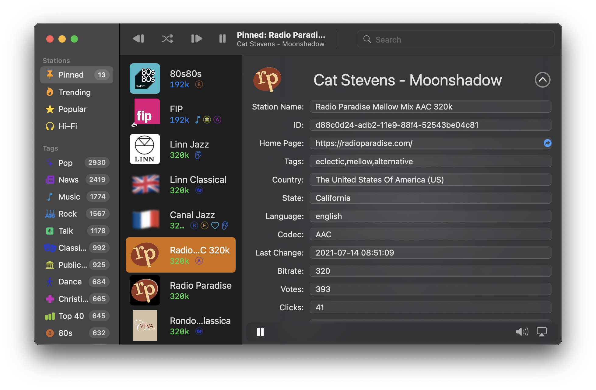

# Tune Out!

Tune Out is a free [App Fair](https://www.appfair.net) app
for browsing and listening to internet radio stations.

It includes 30,000 stations from sources such as the free
[RadioBrowser](https://www.radio-browser.info/) catalog.




## Installation

[Homebrew](https://brew.sh/) users on macOS 12 ("Monterey") can install 
Tune Out directly with the command:

```shell
$ brew install appfair/app/tune-out
```

Tune Out will be installed in the `/Applications/App Fair/` folder,
and can be launched by opening it in the Finder, or by running:

```
$ open "/Applications/App Fair/Tune Out.app"
```


## FAQ

### Does Tune Out use tracking or advertising?

Tune Out is a zero telemetry application.
It sends no identifying information to any individual stations or sites.
The individual stations, however, may elect to serve advertisements
in their content streams.
Since your approximate geographical location can be inferred
from your IP address, this may result in hearing advertisements
that are local to your network entry point, even for stations
originating from another country.

### Where does Tune Out get its station list?

Tune Out uses the station database from the free
[RadioBrowser](https://www.radio-browser.info/) catalog.


## TODO:

  - [ ] Make form un-editable
  - [ ] Merge play/pause buttons 
  - [ ] Table-based frame browsing
  - [ ] Languages section in sidebar
  - [ ] Display video streams ("MP3,H.264", "AAC+,H.264")
  - [ ] Make Countries section collapsed by default
  - [ ] Place "Pinned" badge inside chevron
  - [ ] App preferences:
    1. [ ] Default visible tags
    1. [ ] Visible bitrate range


