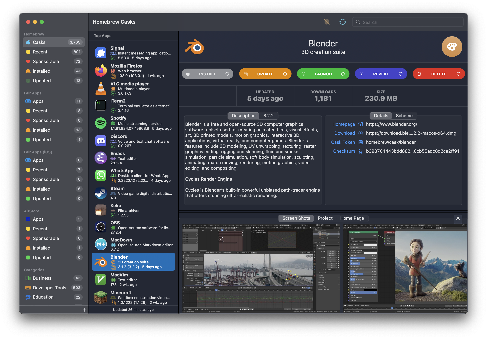

<style>
header {
  display: none;
}

h1, h2, h3, h4, h5 {
  font-family: ui-rounded, Arial Rounded MT Bold, Helvetica Rounded, system-ui, Arial, sans-serif;
}

XXXbody {
    background: #000000FF;
    color: white;
}

XXXhr {
    color: #AAAAAA;
}

XXXa, XXXa:visited {
    color: green;
}

XXXa:hover {
    color: red;
}

XXXcode {
    background: #333333;
}

</style>

<!--
Launch Link (required): https://appfair.app/fair?app=App-Fair
-->



<div>
<a style="text-decoration: none;" href="{{ page.appurl }}/releases/latest/download/{{ page.appname }}-macOS.zip">
<button style="margin-left: auto; margin-right: auto; text-align: center; user-select: none; background-color: #2171A1; color: #FFFFFF; border: none; padding: 12px 12px; text-decoration: none; display: inline-block; cursor: pointer; border-radius: 15px; user-select: none; display: flex; flex-direction: row;">
    <div style="margin-top: auto; margin-bottom: auto;">
    <svg width="44px" height="44px" viewBox="0 0 44 44" version="1.1" xmlns="http://www.w3.org/2000/svg" xmlns:xlink="http://www.w3.org/1999/xlink">
        <g stroke="none" stroke-width="1" fill="none" fill-rule="evenodd">
            <g fill="#FFFFFF" fill-rule="nonzero">
                    <path d="M21.9895883,44 C25.0159331,44 27.8548667,43.4289759 30.506389,42.2869278 C33.1579113,41.1448797 35.493611,39.5598553 37.5134879,37.5318546 C39.5333649,35.503854 41.1194195,33.1643857 42.2716517,30.5134497 C43.4238839,27.8625138 44,25.0281579 44,22.0103823 C44,18.9787636 43.4238839,16.1374862 42.2716517,13.4865503 C41.1194195,10.8356143 39.5333649,8.49614598 37.5134879,6.46814535 C35.493611,4.44014472 33.1544408,2.85512034 30.4959773,1.7130722 C27.8375138,0.571024068 25.0020508,0 21.9895883,0 C18.9771257,0 16.1416627,0.571024068 13.4831992,1.7130722 C10.8247358,2.85512034 8.48556555,4.44014472 6.46568859,6.46814535 C4.44581164,8.49614598 2.86322764,10.8356143 1.71793658,13.4865503 C0.572645528,16.1374862 0,18.9787636 0,22.0103823 C0,25.0281579 0.572645528,27.8625138 1.71793658,30.5134497 C2.86322764,33.1643857 4.44928222,35.503854 6.47610033,37.5318546 C8.50291844,39.5598553 10.8420887,41.1448797 13.493611,42.2869278 C16.1451333,43.4289759 18.9771257,44 21.9895883,44 Z M22.0104117,28.0943841 C21.7188831,28.0943841 21.4447074,28.0355514 21.1878845,27.9178858 C20.9310617,27.8002202 20.7124152,27.6514079 20.5319451,27.4714488 L13.5977283,20.7437471 C13.3894936,20.5499449 13.2333176,20.3215353 13.1292002,20.0585182 C13.0250828,19.795501 12.9730241,19.5532484 12.9730241,19.3317603 C12.9730241,18.7226679 13.1500237,18.2347019 13.5040227,17.8678622 C13.8580218,17.5010225 14.3126676,17.3176026 14.8679602,17.3176026 C15.1733712,17.3176026 15.4406058,17.3764354 15.669664,17.494101 C15.8987222,17.6117666 16.1034864,17.7744219 16.2839565,17.982067 L17.6166588,19.3317603 L20.2612399,22.2180274 L19.9905348,19.0410571 L19.9905348,11.8773006 C19.9905348,11.2405223 20.1744755,10.7248702 20.5423568,10.3303445 C20.9102382,9.93581878 21.3995898,9.73855592 22.0104117,9.73855592 C22.5795867,9.73855592 23.0481148,9.93581878 23.4159962,10.3303445 C23.7838776,10.7248702 23.9678183,11.2405223 23.9678183,11.8773006 L23.9678183,19.0410571 L23.7387601,22.2180274 L26.3416943,19.3317603 L27.7160435,17.982067 C27.910396,17.7882649 28.1290424,17.6290703 28.371983,17.5044832 C28.6149235,17.3798962 28.8821581,17.3176026 29.1736867,17.3176026 C29.715097,17.3176026 30.1628017,17.507944 30.5168008,17.8886267 C30.8707998,18.2693094 31.0477993,18.7434324 31.0477993,19.3109958 C31.0477993,19.5740129 30.9992112,19.8301085 30.902035,20.0792827 C30.8048588,20.3284568 30.6452122,20.5499449 30.4230951,20.7437471 L23.4680549,27.4714488 C23.2875848,27.6514079 23.0689383,27.8002202 22.8121155,27.9178858 C22.5552926,28.0355514 22.2880581,28.0943841 22.0104117,28.0943841 Z M14.3681969,33.2647475 C13.8267866,33.2647475 13.3721407,33.0744062 13.0042593,32.6937235 C12.636378,32.3130407 12.4524373,31.8458392 12.4524373,31.2921189 C12.4524373,30.7383986 12.636378,30.2746579 13.0042593,29.9008966 C13.3721407,29.5271354 13.8267866,29.3402548 14.3681969,29.3402548 L29.6526266,29.3402548 C30.1940369,29.3402548 30.6452122,29.5271354 31.0061524,29.9008966 C31.3670926,30.2746579 31.5475627,30.7383986 31.5475627,31.2921189 C31.5475627,31.8458392 31.3670926,32.3130407 31.0061524,32.6937235 C30.6452122,33.0744062 30.1940369,33.2647475 29.6526266,33.2647475 L14.3681969,33.2647475 Z" id="Shape"></path>
            </g>
        </g>
    </svg>
    </div>
    <div style="padding-left: 16px; padding-right: 16px;">
        <span style="font-size: 30px; color: #FFFFFF; font-weight: bold; font-family: ui-rounded, Arial Rounded MT Bold, system-ui, HelveticaNeue, Helvetica Neue;">Download {{ apptitle }}.app</span>
        <br />
        <span style="text-align: right; font-size: 16px; color: #FAFAFA; font-family: system-ui, Arial MT, HelveticaNeue, Helvetica Neue;">12MB – requires macOS 12.5</span>
    </div>
</button>
</a>
</div>   
<br />
<br />

<a href="#screenshots"></a>

Browse, download and install apps from a vast catalog of macOS desktop and mobile applications. The App Fair provides access to thousands of third-party apps through the community “Homebrew Casks” catalog, as well as all the free and open-source apps created using the appfair.net distribution platform.














From world-class web browsers like {{ browsers[0] }}, {{ browsers[1] }}, and {{ browsers[2] }} to essential messaging apps like {{ messengers[0] }}, {{ messengers[1] }}, and {{ messengers[2] }}. From design stars like {{ design[0] }}, {{ design[1] }}, and {{ design[2] }} to crucial technologies like {{ tools[0] }}, {{ tools[1] }}, and {{ tools[2] }}. And from media streaming apps like {{ players[0] }}, {{ players[1] }}, and {{ players[2] }} to game platforms like {{ games[0] }}, {{ games[1] }}, and {{ games[2] }}. The App Fair is your missing source for all the Mac apps that you need to use, and love to use, every single day.

For help and assistance with the App Fair,
visit the [project discussions](https://github.com/App-Fair/App/discussions),
join the [discord channel](https://discord.gg/R4bFP8qpw7),
and browse the [issue reports](https://github.com/App-Fair/App/issues).

## Straight from the Makers

The apps you get through the App Fair come straight from their creators, with no intermediaries. They may be free applications, or they may be commercial software with their own licensing and purchase mechanisms. They all benefit from the full protection of macOS's built-in security features like _Gatekeeper_ and _XProtect_, while at the same time remaining unconstrained by many of the limitations that can hobble apps installed through other channels. 

## Free and Fair

The App Fair is created and maintained by the community, for the community.
It does not track you or advertise to you, nor does it impose any terms or conditions.

Every line of code in the App Fair.app itself is open-source, released under the GNU AGPL license, and available to browse freely on [GitHub](https://github.com/App-Fair/App.git). The build process is completely transparent and the artifacts are verified by [appfair.net reproducible builds](https://www.appfair.net/#what-are-reproducible-builds).


## Enter the App Fair

Download <a style="text-decoration: none;" href="{{ page.appurl }}/releases/latest/download/{{ page.appname }}-macOS.zip">App Fair.app</a> for macOS Monterey now. For existing homebrew users, it can alternatively be installed and launched by running the following command from Terminal.app:

<pre>
brew install app-fair && open "/Applications/App Fair.app"
</pre>


## Frequently Asked Questions

<a name="sources"/>
#### Where does the App Fair get its apps?

App Fair.app integrates with the following sources of apps:

  - **AppCasks**: This catalog integrates with the brew casks database, which is curated and maintained by the [Homebrew Project](https://brew.sh).
  - **AppSources**: This open format is used by [appfair.net](https://appfair.net/#appsource) to describe a catalog for previewing, downloading, and installing apps.

#### How do I add additional sources to the App Fair?

The ability to add custom external sources is experimental
and must first be activated from the "Advanced" preferences panel.
Once enabled, new sources can be added with the
plus ("+") button at the bottom of the navigation sidebar.

#### Where does App Fair.app install apps locally?

Apps installed from the Homebrew Casks catalog are typically placed in the system `/Applications/` folder, although this can vary depending on the Cask.

Apps installed from the Fairground App catalog will are placed in the `/Applications/App Fair/` folder. Apps installed from other app sources are places in a folder named with the identifier of the catalog: `/Applications/App Fair/app.source.identifier`.

#### What languages is the App Fair available in?

App Fair.app is currently available in English, French,
and Norwegian.

Translators are invited to help translate the App Fair strings into
their local language.
We use the "Weblate" translation interface to enable
translation contirbutions without needing to use
source control management directly.

Start contributing by going to:
[hosted.weblate.org/projects/appfair/app-fair](https://hosted.weblate.org/projects/appfair/app-fair/#translations).

#### What does the "app already exists" error mean during installation?

You may have already installed the app by downloading it directly or installing it through another mechanism. By default, the App Fair.app won't overwrite an existing app when attempting to install it. You can either remove the app manually by placing it in the Trash, or else enable the “Install overwrites previous app installation” checkbox in the "Homebrew" preference panel of App Fair.app.

#### How do I un-install an app?

You can remove an app with the “Delete” button on the catalog entry for that app. You can also simply delete the app from the `/Applications/` folder, but note that for apps obtained from the Homebrew Casks catalog this will not necessarily run all the cleanup steps (like halting daemons and disabling launch services for the app), so it is always recommended that your use the “Delete” button to remove apps.

#### Are the apps native and universal?

All apps published through the Fairground App catalog are native SwiftUI apps that are compiled for both ARM and Intel processors, resulting in a "universal" binary that makes optimal use of your Mac's hardware.

Apps acquired through the Homebrew Casks catalog, however, are not guaranteed to be either universal (they may only be compiled for Intel and emulated under Rosetta, or they may not be compiled at all) nor native (they may use Electron, Qt, or Java instead of the system-native frameworks).


#### Can I purchase apps with App Fair.app?

Individual apps acquired through the Homebrew Casks catalog may have their own built-in trial and purchasing systems. The free open-source apps published through the Fairground Apps catalog may have options for patronage and sponsorship.

In addition, app developers may declare themselves as accepting sponsorship,
which is described in the <a href="#sponsorable">Sponsorable</a> section.

#### What permissions do I need to install apps?

To install apps from the Fairground Apps, the current user needs permission to write to the `/Applications/App Fair/` folder. In the event this is not writable by the current user, the app will attempt to escalate permissions to perform the installation, which will require an administrator password.

Apps installed through the Homebrew Casks catalog typically just require the ability to write to the `/Applications/` folder, but for system-level apps or extensions, the installation process may request an administrator password to complete the installation.

#### How does the App Fair work with auto-updating apps?

Many apps utilize an embedded framework called “Sparkle” to check for updates and automatically download and install the most recent version. When an update occurs in this way, the event is not visible to the homebrew environment used by App Fair.app, so any apps that have been auto-updated will still show up in the App Fair as being available for download and update. The preference "Exclude auto-updating apps from updates list" exists to prevent these apps from showing up in the updates list.

Another difference is that the Sparkle system of auto-downloading updates doesn't “quarantine” the downloaded artifacts, thereby skipping the operating system's gatekeeper check for malware. The App Fair, on the other hand, does respect the quarantine flag by default (subject to the "Quarantine installed apps" preference), which means that both the initial download of an app as well as any updates that are downloaded via the App Fair will be subject to gatekeeper scrutiny.

<!--
#### How to resolve the error that the app “cannot be opened because the developer cannot be verified”?

Apps installed from the Homebrew Casks catalog are expected to be “notarized”, which means that the creator holds a paid subscription to the macOS developer program. Some applications, often from students or non-profit organizations, cannot afford to maintain this subscription or are unable to accept the attendant terms and conditions. In these cases, the applications are distributed without being notarized.

The system's warning message that “macOS cannot verify that this app is free from malware” is inaccurate. These apps are indeed still subject to the built-in protections afforded by macOS such as XProtect and the Malware Removal Tool. If you have installed an app from a trusted source that exhibits this warning dialog, there are two possible solutions:

1. Disable the "Quarantine installed apps" checkbox in the "Homebrew" preferences pane, and then delete and re-install the app. Once the app has been installed, you can re-enable the default quarantining behavior.
2. "Reveal" the app in the Finder, then right-click on the app and select "Open". You will need to perform this action *twice* for it to take effect.

More information about this issue can be read at 

-->

#### How can I update App Fair.app?

If the "Keep catalog app up to date" checkbox is enabled in the App Fair preferences, App Fair.app will automatically install any updates to the catalog app, provided it is installed in the `/Applications/` folder. This will happen the next time the catalog is refreshed, either manually or when the app is next launched.


<a name="privacy" />
### Privacy and Security FAQs

<a name="safety" />
#### How safe are the apps?

Apps installed using the App Fair.app are granted the same system-level protections as all the other apps on your Mac, regardless of how they were acquired. This includes proactive defenses like _Gatekeeper_ and _XProtect_. They also benefit from ongoing analysis and remediation by the system's _Malware Removal Tool_. 

Apps acquired through the Homebrew Casks catalog are typically “notarized”, which means the app is from a registered developer and has been subject to scanning and compliance assessment. These apps, while signed, may or may not be “sandboxed”, and so may affect your system with elevated permissions.

Apps acquired through the Fairground Apps catalog are always “sandboxed”, which means they are restricted in the activities that can be performed. Any ability to access your documents, photos, network, or peripherals will be identified in the app's description. The sum of the permissions that are requested by the app are summarized by the “Risk Level” that is displayed by the App Fair.app. This rating informs a user's decision whether to trust and install an app or not, and thus provide full disclosure to users of the potential impact of installing an app.


<a name="tracking" />
#### What identifying information does App Fair.app track or transmit?

Basically, none. The server-side component of the App Fair itself is simply a set of HTML, JSON, and other static binary files hosted on GitHub and periodically updated using GitHub actions. There are no logins, cookies, or trackers built into either the client-side or server-side components. This can be verified by inspecting the [source code](https://github.com/App-Fair/App.git).

Since App Fair.app downloads apps directly from the app creator's servers, those servers will see a requestor's IP address (e.g., _255.0.198.255_), their primary language (e.g., _"Accept-Language: en-US"_), and their app version (e.g., _"User-Agent: App Fair/622 CFNetwork/1329 Darwin/21.3.0"_), from which an approximate geographical location could be inferred. While no cookies or personally identifying information is transmitted by App Fair.app, an intermediary (such as an ISP) may be able to infer that, say, someone at address 255.0.198.255 in Lilliput downloaded Signal.app. If this is a concern, you may wish to use a VPN when running App Fair.app.


<a name="app-launch-privacy" />
#### What is App Launch Privacy?

The macOS operating system reports all application launches to
third-party servers, which can be intercepted by intermediaries
and reveal which apps you are launching and when.
`App Fair.app` can prevent this tracking from taking place
by temporarily blocking network traffic to these servers
during the launch of an application.

This feature is not enabled by default, but can be turned on
in the App Fair's Privacy setting.
Enabling this feature will require authenticating as an administrator,
and will install a tool named `applaunchprivacy` that
will be run in order to enable and disable 
“App Launch Privacy” mode.

App Launch Privacy will block telemetry from being sent
when an app is opened using the App Fair's “Launch” button,
or when it is manually enabled using the shield button.
It accomplishes this by making temporary edits to the system's
`/etc/hosts` file to redirect the DNS lookup of the
telemetry servers.

Privacy mode will be automatically de-activated after
the specified duration (which defaults to 1 minute).
It is also disabled when quitting App Fair.app.

In addition, once installed, the privacy mode can be enabled
by running the following command from `Terminal.app`:

```
$ ~/Library/Application\ Scripts/app.App-Fair/applaunchprivacy enable
```

Note that when enabling the privacy mode manually, it will
not automatically expire, but will remain enabled until it is 
manually deactivated with the command:

```
$ ~/Library/Application\ Scripts/app.App-Fair/applaunchprivacy disable
```

App Launch Privacy mode should not be left permanently enabled,
because it may prevent certificate revocation checks from
taking place.

You can check the status of App Launch Privacy mode by
running the tool with no arguments:

```
$ ~/Library/Application\ Scripts/app.App-Fair/applaunchprivacy
```

Or you can just check for the blocked entries manually by running:

```
$ cat /etc/hosts
```

More information on the topic of tracking app launches
can be found [here](https://eclecticlight.co/tag/ocsp/).

<a name="casks" />
### Homebrew Cask FAQs

#### What are Homebrew Casks?

The Homebrew project, started in 2009, is a free and
open-source package management system that makes 
it simple to install third-party applications, whose
installation specifications are called "casks".

App Fair.app integrates with Homebrew to provide
convenient access to the thousands of apps that are
available in the Homebrew Cask catalog.

Read more about Homebrew at [https://brew.sh](https://brew.sh),
and at the [Casks documentation](https://github.com/homebrew/homebrew-cask).

#### Where are Casks hosted?

Individual casks are hosted on the developer's site,
from where they will be downloaded by App Fair.app and
verified using the published SHA-256 checksum.

#### How quickly are Cask updates made available on the App Fair?

Once a third-party Cask update passes through the 
[Homebrew Cask update process](https://docs.brew.sh/How-To-Open-a-Homebrew-Pull-Request#submit-a-new-version-of-an-existing-cask),
it should be automatically available in the App Fair
once the catalog is next updated.
The catalog is typically regenerated once an hour. 

#### Is every Homebrew cask available on the App Fair?

Only Homebrew casks that contain installable applications (as opposed
to servers, daemons, or command-line tools) are displayed in the
App Fair by default.
This is controlled by the Homebrew preference pane's
"Show casks without app artifacts" toggle.
Note that if you install a cask without an associated
launchable app, the App Fair's "Launch" button will
not be usable for that cask.

In addition, casks that have dependencies are also 
not installed by default. App Fair.app does not support
dependency installation by default, but some casks that
have dependencies may work. You can enable this feature
with the "Automatically install dependencies" toggle 
in the Homebrew preferences tab.

There may be other factors that prevent a cask from being
displayed in the App Fair.
A complete list of the App Fair's casks is available at
[https://appfair.net/appcasks](https://appfair.net/appcasks).
This can be compared to the list of all Homebrew Casks at
[https://formulae.brew.sh/cask](https://formulae.brew.sh/cask).


### App Creator FAQs

#### How can I get my app in the App Fair?

The App Fair.app supports two separate catalog channels:

1. **Homebrew Casks**: this community-driven project publishes an index of third-party apps and information about how to download and install them. You can learn more at [  https://brew.sh](https://brew.sh).
2. **Fairground Apps**: these open-source SwiftUI apps are included in an index of the forks of a base SwiftUI app repository. Learn more at [https://appfair.net](https://appfair.net).

If you are starting a brand-new green-field open-source SwiftUI project, and would like the services that are provided by appfair.net such as the automated build and release process, landing page generation, support for issues and discussions, and screenshot and icon previews, you can become an App Fair Creator with [appfair.net's Quick Start Guide](https://www.appfair.net/#quick-start).

If, on the other hand, you already having an existing notarized Mac app that you are distributing, you can add it to the Homebrew Casks index by following the directions in their [Cask Cookbook](https://docs.brew.sh/Cask-Cookbook).

#### How can I add, update, or remove my app's "Cask" information?

The App Fair uses the Homebrew casks API directly as the app list presented to users. If your app is already present in the [list of available casks](https://github.com/Homebrew/homebrew-cask/tree/HEAD/Casks), you can submit a [pull request](https://docs.brew.sh/How-To-Open-a-Homebrew-Pull-Request#cask-related-pull-request) to update or remove it.

If you would like to add your existing app to the Casks list, and if your app meets their required [notability threshold](https://docs.brew.sh/Acceptable-Casks#exceptions-to-the-notability-threshold), you can get it added by [filing a pull request](https://docs.brew.sh/How-To-Open-a-Homebrew-Pull-Request#cask-related-pull-request).

<a name="customize_app" />
#### How can I customize how my app appears in the App Fair.app?

If your app is present in the Homebrew Casks but is lacking an icon (or is using the fallback `/favicon.ico` content from your app's homepage), you can provide a supplementary app catalog entry with an icon and app screenshots by [forking the appcasks repository](https://github.com/appfair/appcasks.git) into an organization whose verified domain matches the homepage of the app. 

Creating a release in your forked `appcasks.git` repository with your app's Cask token as the `tag` will allow you to attach binaries like `AppIcon.png` and `screenshot_01-mac-dark-800x600.png` that will then be automatically included in the app's catalog representation when the catalog is next re-built (which happens at least once an hour).

To categorize the app, create a file named "category-NAME" in the releases file, where NAME is one of: `business`, `developer-tools`, `education`, `entertainment`, `finance`, `games`, `graphics-design`, `healthcare-fitness`, `lifestyle`, `medical`, `music`, `news`, `photography`, `productivity`, `reference`, `social-networking`, `sports`, `travel`, `utilities`, `video`, `weather`.

The file must contain only a byte (one newline). That file will be used for placing your app in the correct category. Only a single category is permitted; if multiple "category-NAME" files exist, it is undefined which one will be used.

`README.md` and `RELEASE_NOTES.md` files can also be included, which can contain simplified markdown (bold, italics, and links) describing the app and its latest release.


<a name="sponsorable" />
#### How can I list my app as available for sponsorship in App Fair.app?

Apps that are represented on the App Fair, regardless of their source catalog,
can list themselves as being available for sponsorship in the 
form of financial patronage or other support.

Patronage is handled using the GitHub repository's `FUNDING.yml` file, 
either in the source repo for a Fairapp 
or in the appcasks fork for the customization of an owned cask.
Support for funding links is supported by redirecting the funding 
buttons and heart icons through to the app owner's funding destination.

Further information on setting up your repository as being eligible for funding
can be found in the [GitHub documentation](https://docs.github.com/en/repositories/managing-your-repositorys-settings-and-features/customizing-your-repository/displaying-a-sponsor-button-in-your-repository).

Note that the only funding platform currently supported is GitHub.
More funding platforms are expected be added in the future.

#### How can I link to my app's catalog item?

Create a link formatted as `https://www.appfair.app/fair?cask=<token>`, where `<token>` is your cask's [token](https://docs.brew.sh/Cask-Cookbook#token-reference). This will take the user to a landing page that then tries to launch the `App Fair.app` and display the catalog item as well as offering the user a link to install the app directly. 

For example, a link that directs the user to install Minecraft is: `https://appfair.app/fair?cask=minecraft`.

#### How can I submit an update to my app?

Apps that are distributed through [appfair.net](https://www.appfair.net) will have their updates automatically reflected in the catalog the next time it is generated (hourly).

For apps distributed through Homebrew Casks, updates can be registered by following [these instructions](https://docs.brew.sh/How-To-Open-a-Homebrew-Pull-Request#submit-a-new-version-of-an-existing-cask).

<!--

#### Can I distribute an iOS app with the App Fair?

Homebrew Casks only support macOS apps. There is experimental support for creating iOS apps through [appfair.net](https://www.appfair.net/#how-do-i-target-either-macos-or-ios-instead-of-both), but there is currently no well-supported channel for their installation on iOS devices. This is expected to change in the near future.

-->


### Advanced User FAQs

#### How does the App Fair co-exist with an existing Homebrew installation?

The App Fair bundles Homebrew itself and stores it in a unique location at `~/Library/Application Support/app.App-Fair/appfair-homebrew/Homebrew/bin/brew`. It uses the `HOMEBREW_INSTALL_FROM_API` mechanism to avoid needing to clone the entire cask repository and speed up the process of managing cask apps.

Before invoking the `brew install` command, App Fair.app will 
download cask artifacts to the `~/Library/Caches/Homebrew/downloads/` 
folder (subject to the Homebrew “Use integrated download manager” preference),
which allows the app to track the progress of downloads and
handle user cancellation.

#### Can I remove an app using the command line?

Your local `brew` command can be used to manage your Homebrew Casks.
 
```
$ ~/Library/Application\ Support/app.App-Fair/appfair-homebrew/Homebrew/bin/brew uninstall --cask rectangle
==> Uninstalling Cask rectangle
==> Removing App '/Applications/Rectangle.app'
==> Purging files for version 0.51,57 of Cask rectangle
```


### App Fair Development FAQs

#### Where can I discuss features and improvements to the App Fair?

Bugs and issues should be reported via the App Fair
GitHub issues page at
[https://github.com/App-Fair/App/issues](https://github.com/App-Fair/App/issues).

Discussions about features and suggestions should be discussed on the
GitHub discussions board for the project at
[https://github.com/App-Fair/App/discussions](https://github.com/App-Fair/App/discussions).

Real time discussion about the project can take place on the
[App Fair Discord](https://discord.gg/8F6eBUMMNk).


<br />
<br />

<hr />

<a name="screenshots" />
<h3><center>Screenshots</center></h3>
